# Azure Virtual Machine Scale Sets (VMSS) Bootstrapping & Stress Testing Lab

A step-by-step implementation guide detailing the manual deployment, post-provisioning configuration using Custom Script Extensions, and workload stress testing across an Azure Virtual Machine Scale Set (vmscaleset) in the Azure Portal.

---

## 1.Architecture & Provisioned Resources

All lab infrastructure was created in the East US region:

* Virtual machine scale set: vmscaleset - Standard_B2s (2 vCPUs), Ubuntu Linux, Uniform orchestration, 3 instances
* Network security group: basicNsgvnet-nic01 - Ingress boundary control allowing SSH (port 22) and HTTP (port 80)
* Storage account: scalesetstoragedemo - Standard LRS storage hosting blob container scalesetcontainer
* Virtual network: vnet - CIDR 10.0.0.0/16, subnets default and snet-eastus-1

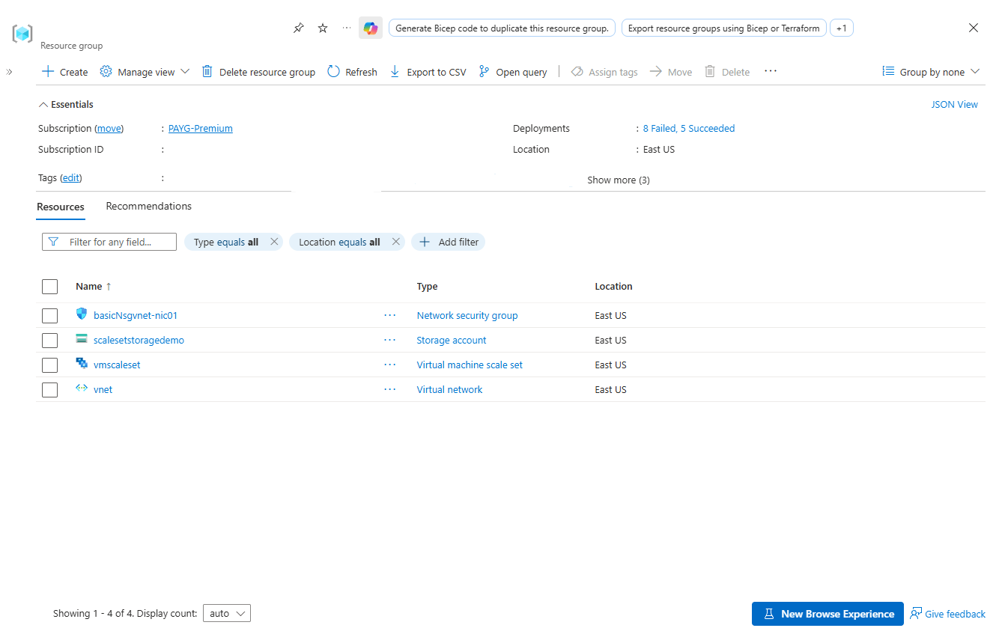
*Resource group overview showing all deployed infrastructure.*

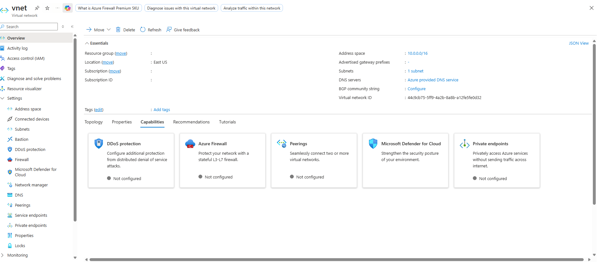
*Virtual network configuration and capabilities.*

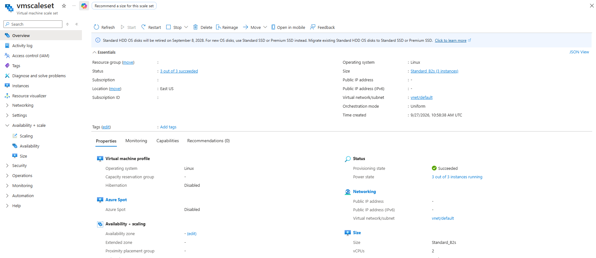
*Virtual Machine Scale Set essentials and instance configuration.*

---

## 2. Step-by-Step Manual Implementation

### Step 1: Configure Network Security Group Rules

To permit remote terminal administration and public web requests to the instances, inbound security rules were added to basicNsgvnet-nic01:

1. Navigated to Network security groups > basicNsgvnet-nic01 > Settings > Inbound security rules.
2. Added rule SSH: Port 22, Protocol TCP, Source Any, Destination Any, Priority 300, Action Allow.
3. Added rule port80: Port 80, Protocol Any, Source Any, Destination Any, Priority 310, Action Allow.

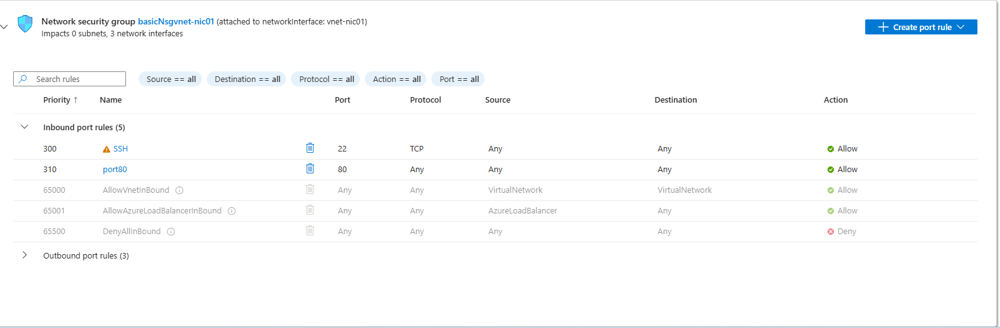
*Inbound security rules configured on basicNsgvnet-nic01.*

---

### Step 2: Prepare & Stage the Bootstrap Script

An automation shell script commands.sh was prepared locally to update system repositories and install the NGINX web server non-interactively.

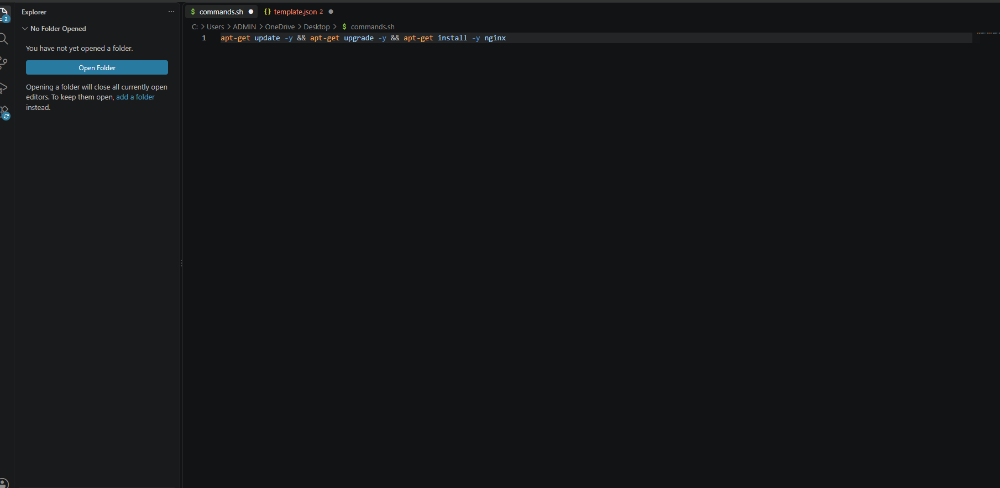
*Preparing commands.sh in the code editor.*

1. Navigated to the storage account scalesetstoragedemo.
2. Opened Data storage > Containers and navigated into scalesetcontainer.
3. Clicked Upload and uploaded commands.sh into the container.

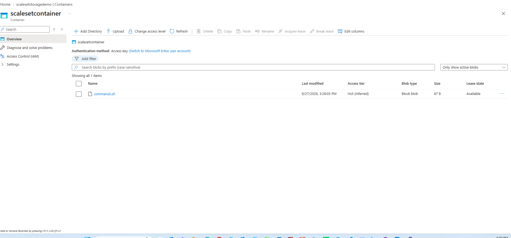
*commands.sh hosted in container scalesetcontainer.*

---

### Step 3: Attach Custom Script Extension & Upgrade Instances

1. Navigated to Virtual machine scale sets > vmscaleset.
2. Under Settings > Extensions + applications, added the Custom Script Extension for Linux (Microsoft.Azure.Extensions.CustomScript) and linked it to commands.sh stored in scalesetcontainer.
3. Because the scale set upgrade policy is configured to Manual, selected all instances (vmscaleset_0, vmscaleset_1, vmscaleset_2) under Instances and clicked Upgrade to apply the extension model.
4. Confirmed all nodes transitioned to Latest model: Yes and Provisioning state: Succeeded.

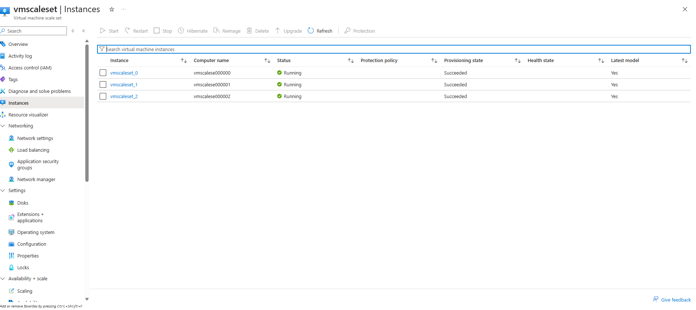
*Instances upgraded and synchronized to the latest VMSS model.*

---

### Step 4: Validate Web Server Deployment

1. Retrieved the assigned public IP address (20.127.48.35) from the scale set network interface.
2. Entered http://20.127.48.35 into a web browser to confirm that NGINX was installed and actively serving traffic.

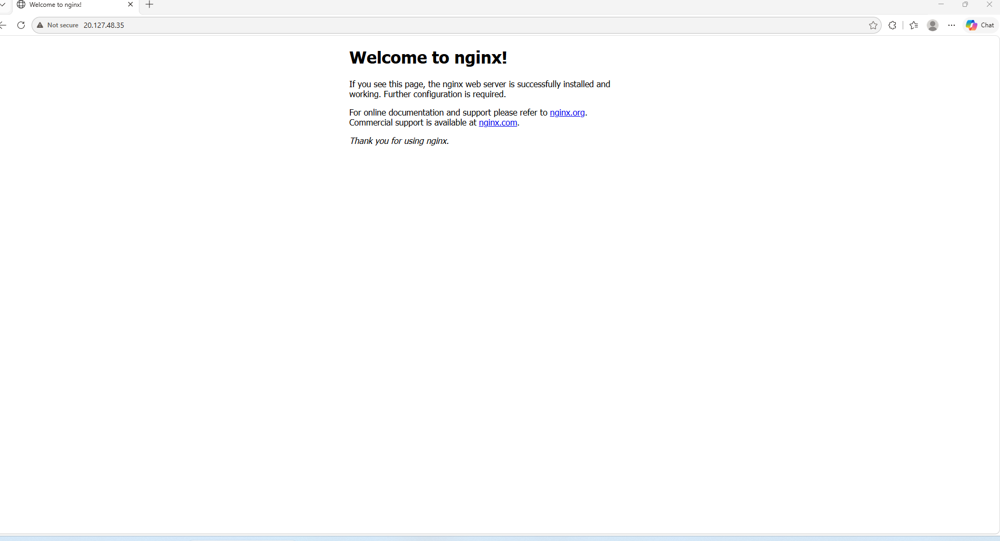
*Verified active NGINX welcome page running on the VMSS instance.*

---

### Step 5: Execute CPU Stress Testing & Verify Metrics

To validate performance telemetry under load:

1. Connected to instance vmscaleset_0 via SSH using the administrative user rootuser.
2. Updated local package indexes using sudo apt-get update.

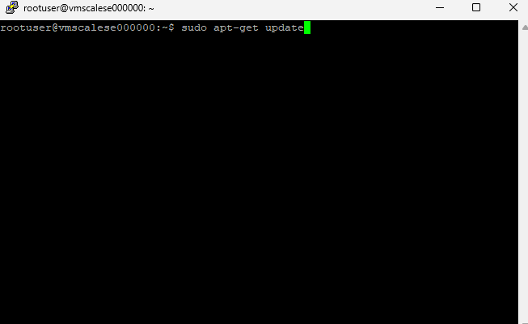
*Running package update on vmscalese000000.*

3. Installed the synthetic load generator stress.

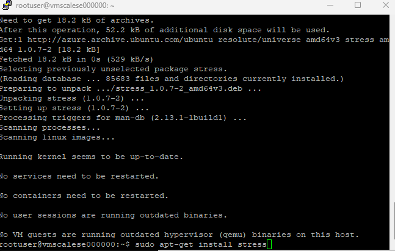
*Installing stress package on vmscalese000000.*

4. Executed the stress test generating 100 worker processes to consume CPU resources.

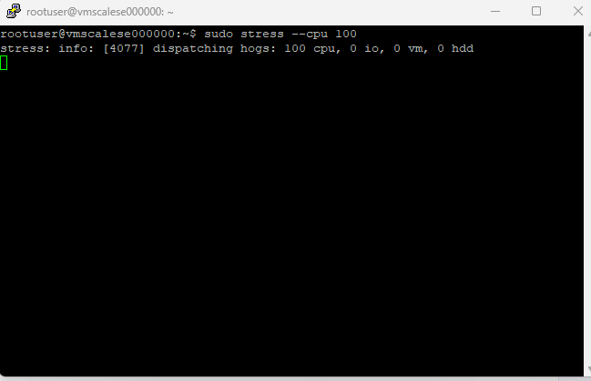
*Dispatching 100 CPU stress hogs.*

5. Monitored Percentage CPU (Avg) on instance vmscaleset_0 in the Azure Portal, verifying sustained saturation past 85% to confirm Azure Monitor responsiveness.

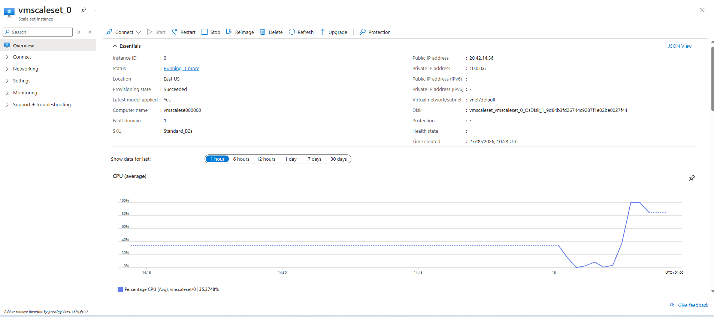
*Azure Monitor CPU metric spike captured during the stress test.*

---

## 3. Engineering Takeaways

* Decoupled Bootstrapping: Custom Script Extensions permit dynamic software deployment from Azure Blob Storage on clean marketplace images without maintaining separate custom machine images.
* Manual Upgrade Lifecycle: When VMSS instances operate under manual upgrade mode, changes to scale set models or extension configurations require explicit manual upgrades across all instances.
* Unattended Script Execution: Commands executed by VM extensions require non-interactive parameters (-y) to prevent process hangs during provisioning.
